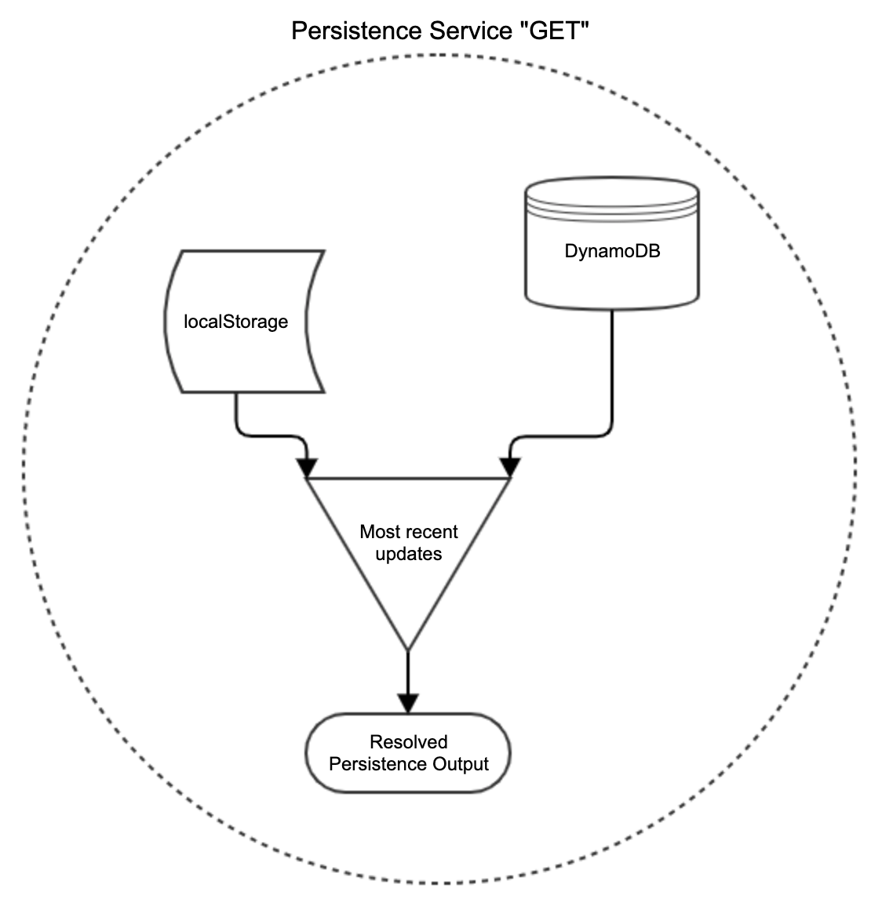
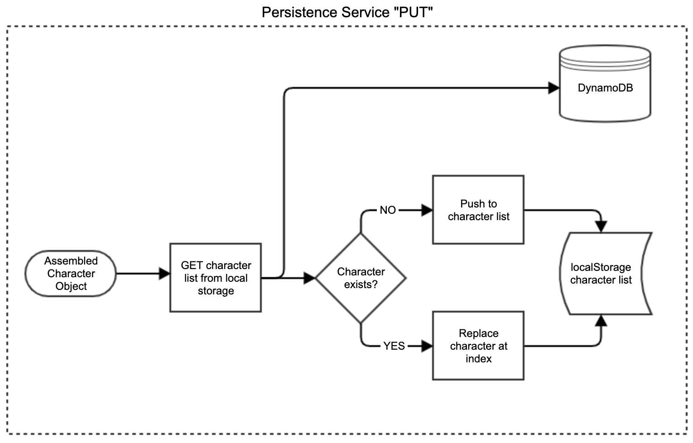
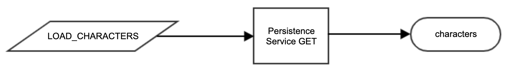
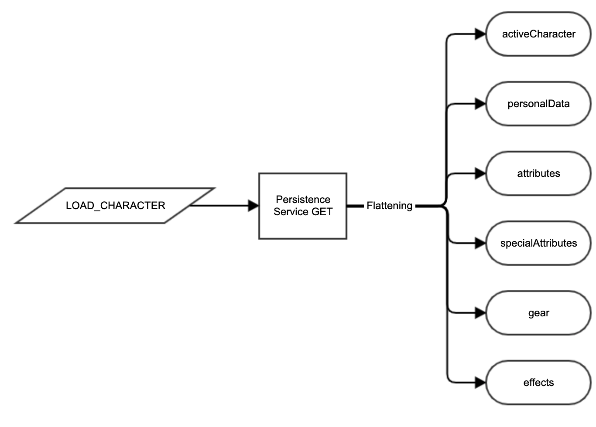
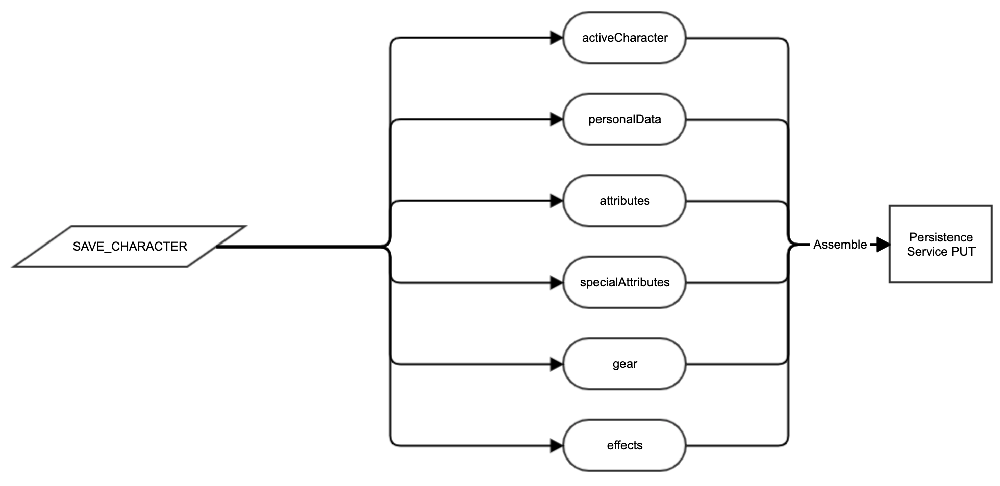

# mighty-runner

Web application for creating and managing Shadowrun Fifth Edition runners.

## Foundation of the Domain Object Model

### Character

```typescript
interface Character {
  userId: string
  id: string
  created: number
  updated: number
  favorite: boolean
  pic: Pic
  personalData: PersonalData
  attributes: Attributes
  specialAttributes: SpecialAttributes
  gear: GearItem[]
  effects: Effect[]
}
```

```typescript
interface Attributes {
  body: Attribute
  agility: Attribute
  reaction: Attribute
  strength: Attribute
  willpower: Attribute
  logic: Attribute
  intuition: Attribute
  charisma: Attribute
  essence: Attribute
}
```

```typescript
interface SpecialAttributes {
  edge: Attribute
  magic: Attribute
  resonance: Attribute
}
```

```typescript
interface Attribute extends Stat {
  shortName: string
  maximum: number
  value: {
    initial: number
    chargen: number
  }
}
```

```typescript
interface GearItem extends Stat {
  cost: number
  availability: string
  value: {
    rating: number
  }
}
```

### Stat

A **Stat** is the basic object which represents runner data that impacts game mechanics.  Simple values like a runner name, age, etc, are not considered Stats as they don't (usually) have an effect on gameplay.  However, the Agility attribute influences the dice pools a runner uses to resolve actions during play, and therefore qualifies as a Stat from the perspective of the DOM.  The `Attribute` objects that compose `Attributes` and `Special Attributes` extend `Stat`, and `GearItem` also extends Stat.

Stats incorporate several fields which describe them as well as a **value** property which dictates the Stat's impact on gameplay.  The specific components that make up a Stat's value vary among multiple different types of Stats, each of which is defined by extending the Stat interface.  Stats can also be influenced by **Effects**, and they can also carry one or more Effects that influence other Stats.

Note that the value field is further defined by the StatValue interface and provides a default baseline value provider for the stat.  This is done to facilitate cases in which there is a desire to track multiple value sources independently (such as an attribute's metatype starting value + the points spent on the attribute at chargen) while utilizing the sum to determine the overall Stat value.  Some Stats may extend the default value field with additional StatValue-typed fields to increase utility.

```typescript
interface Stat {
    id: string
    name: string
    shortName: string
    description: string
    asEffectTarget: string[]       // Used to determine which effects modify the stat (see below)
    effects: string[]              // List of effect ids which arise from the stat (see below)
    value: StatValue               // Default Stat baseline value provider
}

interface StatValue {
  [property: string]: number
}
```

### Effect

An **Effect** describes how one runner Stat can influence another.  For example, the muscle enhancement cyberware modifies a runner's agility attribute.  The cyberware would be entered as a **Gear** object which extends Stat.  An Effect would be added describing the effect that the cyberware has on the agility Stat, with a target that matches the **asEffectTarget** field in the Stat.  When the effective value of the agility Stat is calculated, it includes the value of the cyberware effect.  Effects can be marked as active or not to reflect equipment that can be turned off or destroyed as well as situational modifiers.  Additionally, Effects can target a specific field within the stat's value property or the overall value sum.

```typescript
{
    id: string
    name: string
    description: string
    target: string[]      // Determines what stat the effect modifies
    targetField?: string  // Determines the specific field in the target stat
    active: boolean
    value: number
}
```

### Pool

The **Pool** object is where the rubber hits the road for game mechanics.  When a runner wants to hit somebody with a weapon, they roll their agility stat + a stat representing their skill with the weapon, with a limit determined by the weapon itself.  A Pool is created to reflect this available action, and the stats which define the dice pool as well as the outcome of the action can be set in the pool using **PoolSources** (see below).

```typescript
{
    id: string
    name: string
    descript: string
    poolSources: string[]
    limitSources: string[]
    outcomeSources: string[]
    descriptiveOutcome: string
}
```

### PoolSource

A **PoolSource** describes how Stats and Effects work together to influence dice pools.

```typescript
{
    id: string
    target: string[]
    targetValueField?: string
}
```

## Application State Management

Application state is maintained in memory via a Redux store, in combination with redundant persistance in a DynamoDB table backed by browser local storage.  Redux middleware provides management of persistence actions.

### Persistence Model

#### DynamoDB Character Table

```typescript
{
    userId: string
    id: string
    data: string
}
```

`data` is a JSON string representation of the character model.

#### localStorage

An array of characters is stored under the key *mighty_runner_characters* following the above Character model.  

### Persistence Service

The persistence service wraps up calls to specific APIs in order to abstract away the task of reconciling conflicts between local and cloud-based persisted data.





### State Action Flow

- LOAD_CHARACTERS: Action which calls out to DynamoDB and localStorage to obtain a list of saved characters and loads the most recent characters into application memory.



- LOAD_CHARACTER: Action which calls out to DynamoDB and localStorage to obtain a single save character, loading the most recent revision



- SAVE_CHARACTER: Action which saves the flattened character model currently loaded into the application state as an assembled character model in both DynamoDB and localStorage



In addition to the specific actions provided above, each element of the application state has actions specific to setting, updating, adding, and/or removing data as applicable:

- personalData:
  - SET_PERSONAL_DATA
- pic
  - SET_PIC
- attributes:
  - SET_ATTRIBUTES
  - UPDATE_ATTRIBUTE
- specialAttributes:
  - SET_SPECIAL_ATTRIBUTES
  - UPDATE_ATTRIBUTE
- gear:
  - SET_GEAR
  - UPDATE_GEAR
  - ADD_GEAR
  - REMOVE_GEAR
- effects:
  - SET_EFFECTS
  - UPDATE_EFFECT
  - ADD_EFFECT
  - REMOVE_EFFECT
- apiError (not included in character model):
  - SET_API_ERROR
  - SET_API_HEALTH

Additionally, all actions which modify the in-memory application state for a component of the character model trigger an asynchronous call to persist data to the backend.  Middleware applied to the Redux store determines which actions will trigger LOAD_CHARACTER, LOAD_CHARACTERS and SAVE_CHARACTER actions.  SAVE_CHARACTER actions are never dispatched directly from a component or container.


